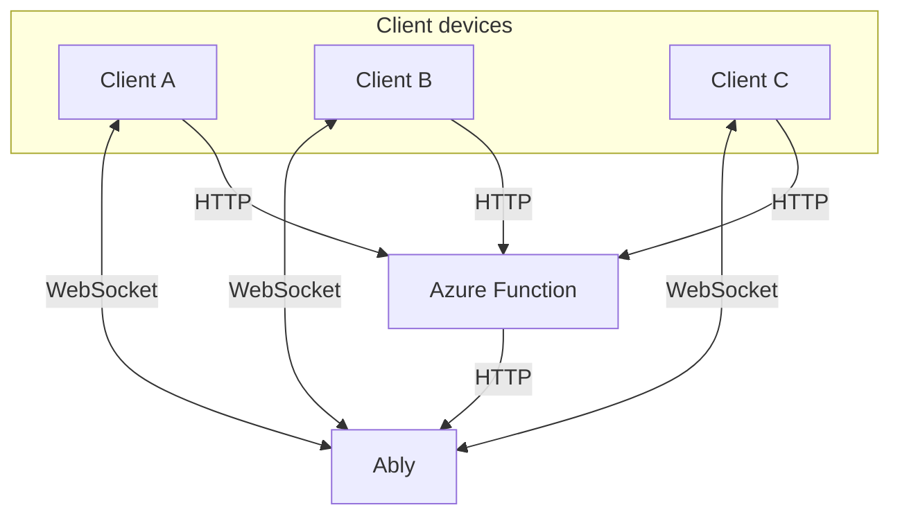

# Collaborative pixelart drawing

## Description

This repository contains an example how to synchronize state in realtime between many client devices using serverless WebSockets (Ably or Azure Web PubSub). The context of the example is a collaborative drawing canvas that multiple people can use at the same time to draw pixelart.

This repository contains two implementations of the same project:

- The [`main` branch](https://github.com/ably-labs/collaborative-pixel-drawing) of this repo contains the implementation using Ably.
- The [`azure-web-pubsub` branch](https://github.com/ably-labs/collaborative-pixel-drawing/tree/azure-web-pubsub) contains the implementation using Azure Web PubSub.

## Tech stack

This project uses the following components:

- [p5js](https://p5js.org/); A creative coding library, used for the drawing canvas.
- [Ably](https://ably.com/); A realtime messaging platform, used as the serverless WebSockets component.
- [Azure Functions](https://docs.microsoft.com/en-us/azure/azure-functions/functions-overview); A serverless compute service from Microsoft Azure.
- [Azure Static Web Apps](https://docs.microsoft.com/en-us/azure/static-web-apps/overview); An Azure service for hosting static websites.

The `src` folder contains the front-end files which are based on vanilla JavaScript and [p5js](https://p5js.org/).

The `api` folder contains a .NET 6 based Azure Function App with the following functions:

- `ChangeColorPalette`; returns a color palette based on the paletteId that is provided.
- `CreateTokenRequest`; provides an authentication token and is triggered when a connection to Ably is made via the front-end.

## Building & running locally

### Prerequisites

You require the following dependencies to run the solution locally:

- [.NET 6 SDK](https://dotnet.microsoft.com/download/dotnet/6.0). The .NET SDK required for the C# Azure Functions.
- [Node 16](https://nodejs.org/en/). The JavaScript runtime required to install Azure Static WebApps CLI.
- [Azure Static Web Apps CLI](https://github.com/Azure/static-web-apps-cli). This is the command line interface to develop and deploy Azure Static Web Apps. Install this tool globally by running this command in the terminal: `npm install -g @azure/static-web-apps-cli`.
- [Azure Functions Core Tools](https://docs.microsoft.com/azure/azure-functions/functions-run-local?tabs=v4%2Cwindows%2Ccsharp%2Cportal%2Cbash). This is part of the Azure Functions extensions for VSCode that should be recommended for installation when this repo is opened in VSCode.
- [Sign up]((https://ably.com/signup)) for a free Ably Account, [create a new app, and copy the API key](https://faqs.ably.com/setting-up-and-managing-api-keys).

### Building the project

1. Clone or fork this repo.
2. Rename the `api\local.settings.json.example` file to `api\local.settings.json`.
3. Copy/paste the Ably API key in the `ABLY_APIKEY` field in the `local.settings.json` file.
4. Run `swa start` in the root folder.

The local Static Web App should be available at `http://localhost:4280`.

## Contributing

Want to help contributing to this project? Have a look at our [contributing guide](CONTRIBUTING.md)!

## More info

- [Join our Discord server](https://discord.gg/q89gDHZcBK)
- [Follow us on Twitter](https://twitter.com/ablyrealtime)
- [Use our SDKs](https://github.com/ably/)
- [Visit our website](https://ably.com)

---

